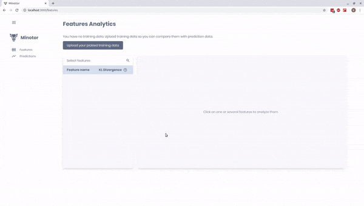

# Tutorial : Minotor Basics

This page explains the basics of monitoring your project using Minotor, once [the installation](Installation.md) is completed in the same environment as your project.

**Important: for now, Minotor is only accepting data that are Numpy arrays or Pandas DataFrame.**

## Import your training data

First of all, you need to import your training data to be able to compare it to the prediction data afterwards. It will enable Minotor to compute some relevant statistics.

### Using the Python decorator

Use the related decorator on your training pipeline.

```python
from minotor.decorators.feature_monitoring import monitor_training_features

@monitor_training_features
def train(data):
    # Do stuff with your data and train your model

```

### Using the interface

When no data has been imported, you will find on the dashboard a button which
will let you do so.

**Don't forget that for now, Minotor is only accepting data that are Numpy arrays or Pandas DataFrame, so you must pickle one of those two types.**

If you can't see the button, you probably have some data already imported. To get
rid of it, use the `minotor clean` command mentionned [here](#Commands).



## Track your prediction data

Use the decorator on your inference function to track continuously your inference data and monitor the differences with your training data.

```python
from minotor.decorators.feature_monitoring import monitor_prediction_features

@monitor_prediction_features
def predict(data):
    # Do stuff with your data and predict through your model

```

**In order to compare those data, the training data and the prediction data you are importing in Minotor must have the same preprocessing, if any.**

## Inspect your data

FILL WITH TUTORIAL WITH SCREENS OF THE FRONT

## Commands

`$ minotor` :arrow_right: starts the Minotor interface

`$ minotor iris-example` :arrow_right: fills the Minotor interface with sample data
from the iris dataset

`$ minotor clean` :arrow_right: cleans both training and prediction data

`$ minotor clean-training` :arrow_right: cleans training data

`$ minotor clean-prediction` :arrow_right: cleans prediction data
